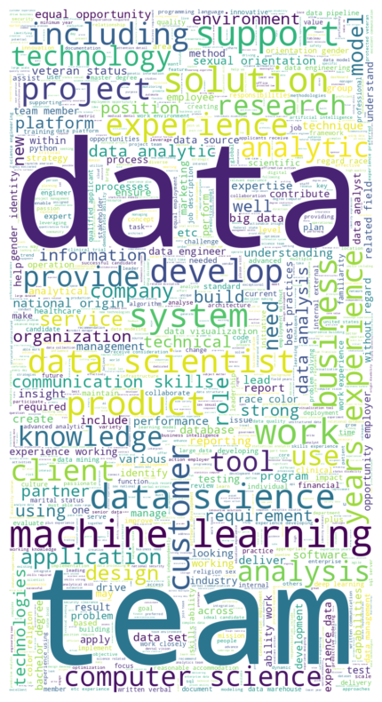

# Data Science Salary Estimator: Project Overview

Developed a predictive tool that estimates Data Science salaries based on job descriptions, location, company attributes, and technical skill requirements — designed to help job seekers make informed salary negotiations.

- Built a full end-to-end machine learning pipeline to predict average salaries with a Mean Absolute Error (MAE) of approximately $11K.
- Scraped and cleaned job postings from Glassdoor using Python and Selenium.
- Engineered features from job descriptions, quantifying the importance of tools and technologies such as Python, Excel, AWS, Spark, and TensorFlow.
- Implemented model optimization using GridSearchCV across Linear Regression, Lasso Regression, and Random Forest Regressor, achieving the best overall performance.
- Deployed a production-ready Flask API for real-time salary predictions.

## Code and Resources

**Python Version:** 3.13  
**Required Packages:** pandas, numpy, scikit-learn, matplotlib, seaborn, selenium, flask, json, pickle  

**To install dependencies:**  
```bash
pip install -r requirements.txt
```

**References:**  
- Scraper GitHub Repository: [https://github.com/arapfaik/scraping-glassdoor-selenium](https://github.com/arapfaik/scraping-glassdoor-selenium)  
- Scraper Tutorial: [Selenium Glassdoor Scraper Article](https://towardsdatascience.com/selenium-tutorial-scraping-glassdoor-com-in-10-minutes-3d0915c6d905)  
- Flask Deployment Tutorial: [Productionize ML Models with Flask and Heroku](https://towardsdatascience.com/productionize-a-machine-learning-model-with-flask-and-heroku-8201260503d2)

## Web Scraping

Modified and extended a Glassdoor scraping script to gather job postings for Data Science-related roles.  
Each record included the following attributes:

- Job Title  
- Salary Estimate  
- Job Description  
- Rating  
- Company  
- Location  
- Company Headquarters  
- Company Size  
- Company Founded Date  
- Type of Ownership  
- Industry  
- Sector  
- Revenue  
- Competitors  

## Data Cleaning

After collecting the raw data, extensive preprocessing was performed to prepare the dataset for modeling.  
The following changes and new variables were created:

- Extracted numeric values from text-based salary estimates.  
- Added flags for hourly pay and employer-provided salary information.  
- Removed rows lacking salary data.  
- Parsed company rating from text.  
- Extracted state information from job location.  
- Created a binary indicator for whether the job is located at the company’s headquarters.  
- Converted the year founded into company age.  
- Created binary indicators for the presence of technical skills:  
  - Python  
  - R  
  - Excel  
  - AWS  
  - Spark  
  - SQL  
- Simplified job titles into broader categories and added a seniority-level feature.  
- Computed a description length variable to measure the verbosity of job postings.

## Exploratory Data Analysis (EDA)

Exploratory Data Analysis was performed to visualize salary trends, feature distributions, and relationships among categorical variables.  

Key findings included:  
- Salary variation across different states and company ratings.  
- Visualization of the most common keywords using a word cloud. 
- Clear evidence that technical skills and company-level factors significantly influence salary levels.
  


## Model Building

### Data Preparation
- Converted categorical variables into dummy variables using `pd.get_dummies()`.  
- Split the dataset into training (80%) and testing (20%) subsets.

### Models Evaluated
Three regression models were tested using **Mean Absolute Error (MAE)** as the evaluation metric, selected for its interpretability and robustness against outliers.

1. **Multiple Linear Regression** – Established a baseline for comparison.  
2. **Lasso Regression** – Applied regularization to handle sparse categorical data.  
3. **Random Forest Regressor** – Chosen for its ability to capture nonlinear relationships and feature interactions.

## Model Evaluation

| Model                 | MAE (Mean Absolute Error) |
| --------------------- | ------------------------- |
| **Random Forest**     | **11.22**                 |
| **Linear Regression** | 18.86                     |
| **Ridge Regression**  | 19.67                     |

The Random Forest model demonstrated the best performance, achieving the lowest prediction error on both training and validation sets.

## Model Deployment

Developed a Flask-based REST API to serve the trained model for real-time salary predictions.

- The API accepts job listing information as JSON input.  
- Input data is automatically formatted to match the model’s training feature structure.  
- Returns a salary prediction in JSON format.

